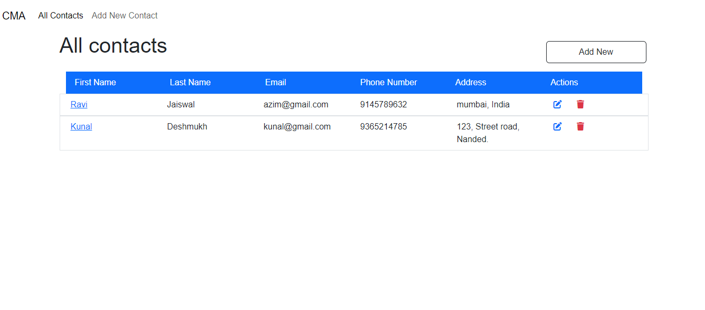

# **Contact Management Application (CMA)**




## **Project Overview**

The **Contact Management Application** (CMA) is a web-based application developed using Node.js, Express.js, MongoDB, and EJS. It allows users to manage their contacts with essential CRUD operations—Create, Read, Update, and Delete. The application ensures proper data validation and error handling, providing a user-friendly interface with persistent storage.

--- 

## **User Instructions**

### **Prerequisites**

1. Install **Node.js** and **npm**.
2. Install **MongoDB** and start the database server.

### **Installation**

1. Clone the repository:
   ```bash
   git clone https://github.com/abdulsattar0617/contact-manager.git
   ```
2. Navigate to the project directory:
   ```bash
   cd CMA
   ```
3. Install dependencies:
   ```bash
   npm install
   ```
4. Start the server:
   ```bash
   npm start
   ```

### **How to Use the Application**

1. **Create a Contact**:
   - Navigate to `/contacts/new`.
   - Fill in the form with contact details and click "Submit".
   - [Watch tutorial - Youtube](https://youtu.be/ql4YLii3z8Q)

2. **Read/Display Contacts**:

   - Visit `/contacts` to see all contacts.
   - Click on a contact to view detailed information.
   - [Watch tutorial - Youtube](https://youtu.be/E-0-gpQ0AhM)

3. **Update a Contact**:

   - Go to `/contacts/:id/edit`.
   - Modify the fields and click "Update" to save changes.
   - [Watch tutorial - Youtube](https://youtu.be/mu7DFiD0_AI)

4. **Delete a Contact**:
   - Navigate to `/contacts/:id/delete`.
   - Confirm the deletion to remove the contact permanently.
   - [Watch tutorial - Youtube](https://youtu.be/oocmdC0MzdQ)

---

## **Route Explanation**

| **Route**              | **Request Type** | **Purpose**                              |
| ---------------------- | ---------------- | ---------------------------------------- |
| `/contacts`            | GET              | Display all contacts                     |
| `/contacts/:id`        | GET              | Display a single contact's details       |
| `/contacts/:id/edit`   | GET              | Render the form to edit a contact        |
| `/contacts/:id/delete` | GET              | Show the delete confirmation             |
| `/contacts`            | POST             | Add a new contact                        |
| `/contacts/:id`        | PUT              | Update an existing contact               |
| `/contacts/:id`        | DELETE           | Delete an existing contact               |
| `/contacts/new`        | GET              | Render the form for adding a new contact |

---

## **Data Model**

- **Database Name**: `contactmanagementapp`
- **Collection**: `contacts`

### **Schema Fields**

- **First Name**: `String` (Required)
- **Last Name**: `String` (Required)
- **Email**: `String` (Required, must be unique and valid)
- **Phone Number**: `String` (Required, must be valid, length 10 and all letters must belong to 0-9 range)
- **Address**: `String`

---

## **Application Architecture**

The application follows the **MVC (Model-View-Controller)** architecture:

- **Models**

  - **Contact**
    - **Fields**
      - **First Name**: `String` (Required)
      - **Last Name**: `String` (Required)
      - **Email**: `String` (Required, must be unique and valid)
      - **Phone Number**: `String` (Required, must be valid, length 10 and all letters must belong to 0-9 range)
      - **Address**: `String`

- **Views**

  - **Contacts**:

    - **Index** (`index.ejs`) – Displays all contacts.
    - **Show** (`show.ejs`) – Renders a single contact’s details.
    - **Edit** (`edit.ejs`) – Displays the form for editing an existing contact.
    - **Delete** (`delete.ejs`) – Shows a confirmation dialog for deleting a contact.
    - **New** (`new.ejs`) – Displays the form for adding a new contact.
    - **Error** (`error.ejs`) – Error page for handling invalid routes or requests.

  - **Layouts**

    - **Boilerplate** (`boilerplate.ejs`) – A master layout that wraps all views for consistent structure.

  - **Includes**
    - **Navbar** (`navbar.ejs`) – Contains navigation and branding.
    - **Footer** (`footer.ejs`) – Footer component for all pages.

- **Controllers**

The following controllers handle the business logic in the application:

| **Controller**     | **HTTP Method** | **Description**                                 |
| ------------------ | --------------- | ----------------------------------------------- |
| `renderDeleteForm` | GET             | Renders the contact deletion confirmation page. |
| `renderEditForm`   | GET             | Renders the contact edit form.                  |
| `renderNewForm`    | GET             | Renders the form to create a new contact.       |
| `destroyContact`   | DELETE          | Deletes an existing contact.                    |
| `updateContact`    | PUT             | Updates an existing contact.                    |
| `showContact`      | GET             | Displays a single contact's details.            |
| `createContact`    | POST            | Creates a new contact.                          |
| `index`            | GET             | Displays a list of all contacts.                |

---

## **Error Handling**

The application handles errors at multiple levels to ensure robustness and user experience.

1. **WrapAsync**: A function wrapper for asynchronous routes that captures and forwards any errors to the central error handler using `try/catch` blocks.
2. **Custom Error Class (ExpressError)**:
   - A custom error class `ExpressError` is used to manage and display meaningful error messages throughout the application.
3. **Error View**:
   - All errors are rendered using the `error.ejs` view, providing a user-friendly interface when errors occur.

## **Future Scope**

The following features can be implemented in future versions of the application:

1. **Session Management**

   - Implement session handling for enhanced control and security of user data.

2. **User Authentication**

   - Implement user login and signup functionality to ensure only registered users can access the application.

3. **Authorization**
   - Differentiate user roles with authorization, so each user can only manage their own contacts.
4. **Integrity**
   - Ensure that each user has access only to their own set of contacts to maintain data privacy and integrity.

## **End**

Thank you for using the Contact Management Application. We appreciate your interest and hope this project meets your needs!
